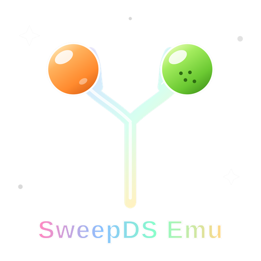

<b>SweepDS Emu</b> is a fork of Azahar (itself a 3DS emulator) that merges in a full DS/DSi core (based on melonDS), so it can run both 3DS and DS/DSi titles side by side in one app -- on desktop and Android.



# DS/DSi Support

The DS/DSi core runs alongside the existing 3DS core rather than replacing it. A DS ROM gets its own player window (desktop) or Activity (Android), with its own dual-screen rendering, audio, and input -- independent of the 3DS side.

- **Forwarder CIAs**: `tools/make_ds_forwarder.py` builds a small 3DS CIA "forwarder" for a DS ROM, so it shows up as a normal icon on the emulated 3DS HOME Menu. Launching that icon jumps straight into the DS ROM instead of the (do-nothing) 3DS stub code the forwarder actually contains.
- **Return to HOME Menu**: while playing a DS game, a rebindable hotkey (F12 by default on desktop; a controller "mode" button or on-screen HOME button on Android) stops the DS session and boots back into the 3DS HOME Menu, matching how forwarders behave on real hardware.
- **Direct DS ROM launch**: `.nds`/`.dsi` files can also be picked directly from the game list without going through a forwarder.
- **Platform status**: forwarder redirection and direct DS launch both work on desktop (Windows/Linux/macOS) and Android. The Android build reads the exact same forwarder mapping file (`ds_forwarders.txt`) as desktop -- generate forwarders on desktop, then copy the resulting CIA and mapping file over.

# Features

Everything from upstream Azahar, plus:
- The DS/DSi core and forwarder system described above
- Compatibility with all game files. If a file works with any Citra fork, it works here.
- Ability to download system files from official servers. No need for an actual 3DS.
- Compatibility with older CPUs (no SSE4.2 required)
- Compatibility with Android 9+
- ZipPass: a way to exchange StreetPass data through zip files
- Built-in cheats
- Amiibo generation
- Better multiplayer compatibility with other Citra forks

The base emulator logo (before this fork's rebrand) was the property of PabloMK7 and angyartanddraw.

---

# Installation

Download the latest build from this repository's [Actions](https://github.com/gammermanbob-droid/SweepDSEmu/actions) runs, or from [Releases](https://github.com/gammermanbob-droid/SweepDSEmu/releases) once one is cut.

### Android

Grab the `android-universal` artifact (`.apk` for direct install, `.aab` for a Play-Store-style bundle). Minimum Android 9.0 (64-bit).

### Cocoon

The easiest way to use this fork with Cocoon is to uninstall Azahar and install this build in its place -- it will be seen as Azahar by Cocoon.

### Batocera

To use this fork with Batocera you can install the Batocera Unofficial Add-ons:

https://github.com/batocera-unofficial-addons/batocera-unofficial-addons

# ZipPass

ZipPass allows you to share StreetPass data in the form of zip files.<br>
On desktop it is in File > ZipPass. On Android it is in the main menu.

- It can only be used when no game is running.
- It requires system files and LLE modules enabled.
- You need to enable StreetPass in your games.
- The export feature will save the StreetPass data of all your games in a xxx.pass.zip file.
- The import feature lets you pick one or several xxx.pass.zip files and will simulate StreetPass tags.
- You can pick as many files as you want for the import but every game has a limit for its queue and anything beyond that will be ignored.
- This is all pretty experimental, so in case of issues there's a menu to disable StreetPass on every game. You won't lose anything -- you'll simply need to enable StreetPass again.

# Build instructions

This is a standard CMake project; see `CMakeLists.txt` and `STARTUP_GUIDE.txt` in the repo root for platform-specific notes (in particular: on Windows, only the `msys2` toolchain is currently supported, not MSVC).

# Minimum requirements

### Desktop
```
Operating System: Windows 10 (64-bit), or modern 64-bit Linux
CPU: x86-64/ARM64 CPU (Windows for ARM not supported). Single core performance higher than 1,800 on Passmark
GPU: OpenGL 4.3 or Vulkan 1.1 support
Memory: 2GB of RAM. 4GB is recommended
```
### Android
```
Operating System: Android 9.0+ (64-bit)
CPU: Snapdragon 835 SoC or better
GPU: OpenGL ES 3.2 or Vulkan 1.1 support
Memory: 2GB of RAM. 4GB is recommended
```

# Credits
- SweepDSEmuNDSBrewer's (Android) menu music is ["Nintendo DS music be like"](https://www.youtube.com/@PatoBoiProductions) by PatoBoiProductions, used with permission.

# Where to find this project
- GitHub: https://github.com/gammermanbob-droid/SweepDSEmu
